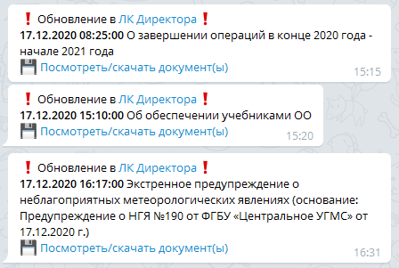

# Educom Telegram Bot

Бот для проверки обновлений ленты новостей в Личном кабинете директора (ЕКИС) <http://lk.educom.ru>
и отправки уведомлений в указанные чаты. Бот не отмечает новости и файлы как прочитанные -
это делают заинтересованные лица вручную и самостоятельно.
Проверка выполняется каждые 30 секунд, обновление сессии каждые 30 минут или принудительно после неудачной проверки.

## Требования

  1. Учетная запись от [личного кабинета](http://lk.educom.ru/login.html).
  1. Токен бота, полученный от [@BotFather](https://t.me/botfather).
  1. Идентификаторы чата администратора (для отправки ошибок бота) и пользователей (для отправки уведомлений).
     Можно получить от [@userinfobot](https://telegram.me/userinfobot) или самого этого бота командой `/start`.
  1. Для получения сообщений от бота Telegram (любого), пользователь должен начать с ним диалог.
     Для этого нужно найти бота в поиске или перейти по ссылке на него.

## Настройки

  1. Установить Python 3.9 (с другими версиями бот не проверялся)
  1. Клонировать и открыть каталог репозитория
  1. Установить зависимости `pip install -r requirements.txt`
  1. Переименовать файл `.env.example` в `.env`
  1. Отредактировать файл `.env`, заменив переменные на свои
      - `LK_USERNAME`: имя пользователя для входа в ЛК
      - `LK_PASSWORD`: пароль для входа в ЛК
      - `BOT_TOKEN`: токен бота
      - `BOT_USERS_CHAT_ID`: идентификаторы чатов пользователей через запятую без пробелов
      - `BOT_ADMIN_CHAT_ID`: идентификатор чата админа
      - `PROXY_URL`: ссылка для http прокси. Параметр можно удалить, если ваш провайдер не блокирует API Telegram. Блокировка выглядит как-то так, но могут быть и другие ошибки: `telegram.error.NetworkError: urllib3 HTTPError [SSL: WRONG_VERSION_NUMBER] wrong version number (_ssl.c:1123)`

## Запуск

Из командной строки `python educom_bot/bot.py`

## Разработка

  1. Клонировать и открыть каталог репозитория
  1. Установить зависимости для разработки `pip install -r requirements.dev.txt`
  1. Установить pre-commit hook `pre-commit install`
  1. Выполнить шаги из раздела [Настройки](#настройки)

## Тестирование

Чтобы не ждать появления свежих новостей в личном кабинете, можно удалить файл `entry.json`, и уведомления с последней новостью будут отправлены заново.
